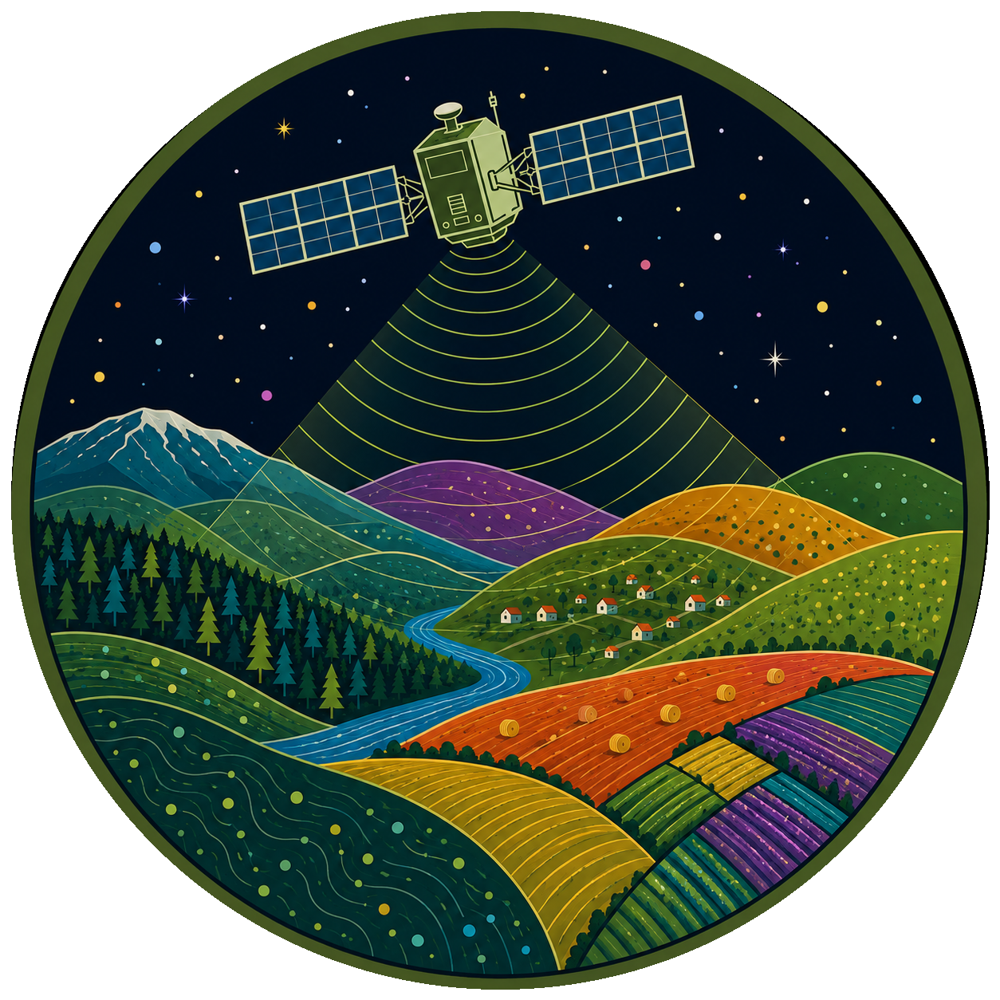

[](https://github.com/0xstepit/lu-lc-classification-with-unet/actions/workflows/tests.yml)
[](https://www.python.org/downloads/)


<div align="center">
  
</div>

# LULC Classification

## Description

This project explores Machine Learning (ML) assisted Land Use and Land Cover
(LULC) classification for a selected Area Of Interest (AOI). The classification
process evaluates and compares the results obtained from a classic ML approach
based on Random Forest and a more advanced one based on deep learning via the
U-Net architecture.

The goal of the project is the definition of a clear and statically sound
approach for the generation of a geospatial dataset, and to assess how
data-driven techniques can be used in the analysis of spatio-temporal patterns.

## What is Land Use and Land Cover?

Land Use and Land Cover (LULC) are two different types of analysis that can be
performed on a piece of land. Land Cover concerns the physical classification of
the land surface, while Land Use determines how people are using that particular
land.

When land is analyzed for land cover, pixels are classified into generic
physical classes such as water, forest, built-up, and grassland. Land cover maps
can be used, for example, to assess the effect of climate change, for disaster
or wildfire management, and for local or regional planning.

Land cover classification can use more specific subclasses, such as cropland,
grassland, and wetland. Changes in land use are mainly driven by humans through
processes such as deforestation or urbanization, and are one of the main sources
of carbon dioxide emissions.

## Process

The project is divided in three milestones:

- AOI selection and generation of an all-seasons raster based on optical data
  obtained from Sentinel-2 satellites.
- Creation of the dataset based on the seasonal imagery from the previous step
  and the WorldCover dataset provided by the European Space Agency (ESA).
- Training, evaluation, and validation of data-driven models.

Each milestone is then divided into finer tasks that are described in detail in
the [docs](./docs/).

## Structure

The project is structured in the following main folders:

- [`src/`](./src/): contains the source code for the analysis pipeline,
  including configuration loader, data models, and core functions.
- [`scripts/`](./scripts/): contains Python scripts that are used for the
  workflow execution. The order of the scripts is defined by the number
  prefixing the filename.
- [`config/`](./config): contains configuration files in
  [TOML](https://toml.io/en/) format that define the main variables of the
  analysis, such as the AOI, the optical bands used, and other parameters.
- [`tests/`](./tests/): contains unit tests for the core functions.
- [`data/`](./data/): stores raw and processed data (not tracked by git).

Other relevant folders are [`notebooks/`](./notebooks/), containing exploration
files for visual inspection, and [`docs/`](./docs/), containing detailed
documentation for each phase.

## Usage

The best way to use this project, is via its Makefile. You can see which
commands are available by running:

```sh
make help
```

### Install

The project dependencies are managed with the [uv](https://docs.astral.sh/uv/)
package manager. To install the dependencies in a virtual environment:

```sh
make install
```

### Scripts

Scripts are the main entry-point for running the pipeline. They must be executed
in order, as each step depends on the outputs of the previous one. Before
running scripts, please review the [configuration section](#configure)

| Script                                                                      | Description                                                                     |
| --------------------------------------------------------------------------- | ------------------------------------------------------------------------------- |
| [`00_select_aoi`](./scripts/00_select_aoi.py)                               | Query Sentinel-2 scene counts for candidate AOIs and creates a report           |
| [`01_download_sentinel2`](./scripts/01_download_sentinel2.py)               | Download all Sentinel-2 L2A scenes for the selected AOI                         |
| [`02_create_seasonal_composite`](./scripts/02_create_seasonal_composite.py) | Apply cloud masking, compute spectral indices, and build the seasonal composite |
| [`03_download_world_cover`](./scripts/03_download_world_cover.py)           | Download ESA WorldCover tiles, mosaic, and remap class labels                   |
| [`04_extract_patches`](./scripts/04_extract_patches.py)                     | Create the dataset by dividing the composite and labels rasters into patches    |

List the available scripts:

```sh
make list-scripts
```

Run a script by specifying the filename without extension with:

```sh
make run-script file=00_select_aoi
```

### Configuration

To configure the behavior of the scripts, you can modify the associated
configuration files in the `/config/` folder. There are two files you can
customize:

- `analysis.toml`: this is the main configuration file that is used to define
  the parameters of the pipeline like the area of interest, the desired bands,
  the patch size in the created dataset, and many others
- `reporter.toml`: this file is used to configure how the scripts report should
  be created and formatted. Only JSON formatted texts are supported at the
  moment.

For more details about each parameter you can configure, please head over the
associated file and read the description of the variables you want to customize.

### Env

Copy and rename the environment file and add your credentials for the Copernicus
Data Space Ecosystem (CDSE).

```sh
mv .env.examples .env
```

If you don't want to use CDSE, please update the configuration accordingly.

### Tests

Unit tests can be executed with:

```sh
make unit-tests
```

## Notebooks

The project is accompanied with small Jupyter Notebooks to help in the
visualization of the geospatial operations performed in the scripts.

To use them, please first install a new IPython kernel:

```sh
make kernel
```

Start Jupyter to access the notebooks:

```sh
make start-notebook
```

Then select the just created kernel when opening the notebook.

## References

1. [Land cover - Wikipedia](https://en.wikipedia.org/wiki/Land_cover)
1. [Land use - Wikipedia](https://en.wikipedia.org/wiki/Land_use)
1. [U-Net: Convolutional Networks for Biomedical Image Segmentation - Ronneberger et al. 2015](https://arxiv.org/abs/1505.04597)
1. [ESA WorldCover 10 m 2021 v200 - Zanaga et al. 2022](https://zenodo.org/records/7254221)
1. [Review on Convolutional Neural Networks (CNN) in vegetation remote sensing - Kattenborn et al. 2022](https://www.sciencedirect.com/science/article/abs/pii/S0924271620303488)
