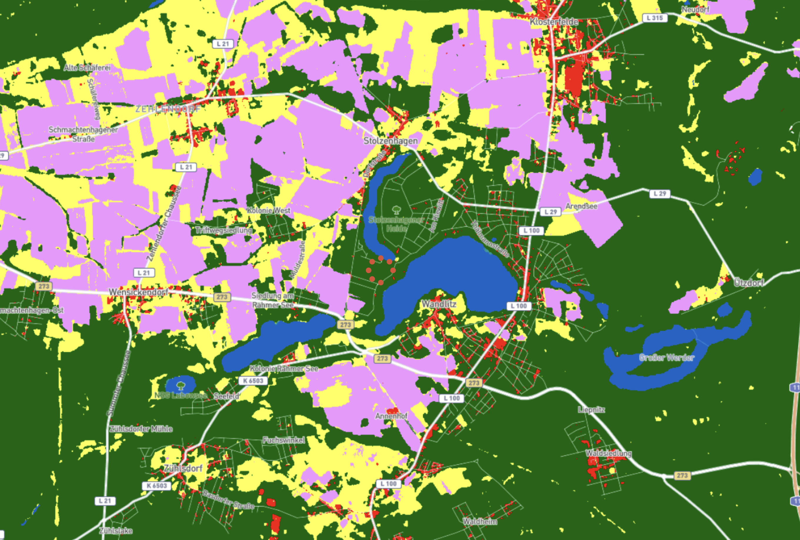

# Area of Interest Selection

This document describes the process undergoing the selection of the Area of
Interested (AoI) for the project.

## Candidates

Three regions have been included as possible candidates in the analysis. The
regions considered are identified by a point described by a latitude and
longitude. The area of interested is the drawn around this point by using the
size variable configurable in the `sentinel2.toml` configuration file.

The considered candidates are: Brandeburg (Germany), Andalusia (Spain), and
Lombardy (Italy).

## Introduction

The scope of this project is to train a U-Net model on a selected area of around
50x50 km, the AoI. We will divide the AoI into training, validation, and testing
set and we'll train the U-Net on the associated WorldCover labels. So, we will
investigate how our U-Net model will be able to approximate the WorldCover data,
which will be considered as the ground truth despite their approximative nature.

We will use Sentinel-2 images for the training of the model providing the
inputs. The WC are the labels.

We are going to use temporal data because it is what provides the real signature
of the land usage. For example, both a cropland and a grassland look green in
July, but their signatures diverge over time.

### WorldCover Project

The WorldCover project has been initiate by the European Space Agency (ESA) and
freely released. The scope of the project was to create a global land cover map
at 10 m resolution to enable applications such as biodiversity, food security,
carbon assessment and climate modelling.

We will use the WorldCover V2 dataset released on 28 October 2022 which has an
overall accuracy of 76.7%.

The algorithm used in the v2 has been trained on 319415 locations with 115
features.

The ESA WorldCover products are provided per 3 x 3 degree tile for a total of
2651\. Each tile is composed of 2 Cloud Optimized GeoTIFF (COG) files:

- A land cover map with 11 classes defined using the Land Cover Classification
  System (LCCS).
- An indicator of the quality of the Sentinel-2 and Sentinel-1 data used into
  classifying each pixel.

The 11 classes are: tree cover, shrubland, grassland, cropland, build-up,
bare/sparse vegetation, snow and ice, permanent water bodies, herbaceous
wetland, mangroves, moss and lichen.

The products are delivered in the classic latitude/longitude grid with cog in
EPSG:4326 projection with the ellipsoid WGS 1984. The grid resolution is
approximately 10m at equator.

The important aspect of this dataset is that it has been *statistically
validated* following the Committee on Earth Observation Satellites (CEOS)
validation guidelines

## Selection Process

### Requirements

The selected AoI must satisfy the following constraints:

- Date: the Sentinel-2 mission should have imagery for the year 2021. The choice
  of the year arise from the availability of high quality training data from the
  [ESA WoldCover] 2021 mapping.
- Cloud: Sentinel-2 data should have \<30% cloud coverage.
- Imagery: there should be at least 30 available scenes.

## Open questions

- Is 30 scene enough?
- Can we correct noise from clouds?
- How accuracy change with the increase in cloud coverage?
- Seasonal composite

## What I've Learned

- What is a seasonal composite.
- The WorldCover dataset.

## References

1. [ESA WorldCover]
1. [WorldCover V2 - Product User Manual]

[esa worldcover]: https://esa-worldcover.org/en/
[worldcover v2 - product user manual]: https://esa-worldcover.s3.eu-central-1.amazonaws.com/v200/2021/docs/WorldCover_PUM_V2.0.pdf
